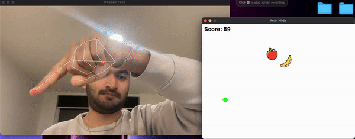

# Gesture-Controlled Fruit Ninja Game 🎮🍉

This project is a **gesture-controlled version** of the classic *Fruit Ninja* game, implemented using Python. Players can slice falling fruits by using hand gestures tracked through their webcam. The game combines **computer vision** with **game development** by leveraging **Mediapipe**, **OpenCV**, and **Pygame**.

---

## Features 🚀

- **Hand Gesture Control**:
  - Uses Mediapipe to detect hand gestures via webcam.
  - Slices fruits by detecting the movement of your index finger.

- **Dynamic Gameplay**:
  - Fruits fall at random positions and speeds.
  - Score increments when fruits are successfully sliced.

- **Real-Time Visualization**:
  - Displays hand landmarks and index finger tracking on the webcam feed.
  - Shows a green dot representing the slicing tip of the index finger.

- **Interactive Audio & Graphics**:
  - Includes slicing sound effects for better immersion.
  - Uses real fruit images for game visuals.

---

## Table of Contents 📖

1. [Technologies Used](#technologies-used)
2. [Project Structure](#project-structure)
3. [Installation](#installation)
4. [How to Run](#how-to-run)
5. [Game Mechanics](#game-mechanics)
6. [Screenshots](#screenshots)
7. [Future Enhancements](#future-enhancements)
8. [Credits](#credits)

---

## Technologies Used 🛠️

- **Languages**: Python 3.11
- **Libraries**:
  - [Mediapipe](https://google.github.io/mediapipe/) for hand tracking.
  - [OpenCV](https://opencv.org/) for webcam integration and video processing.
  - [Pygame](https://www.pygame.org/) for the game interface and mechanics.

---

## Project Structure 🗂️

```
Gesture-Controlled-Fruit-Ninja-Game/
│
├── assets/
│   ├── images/                # Game assets
│   │   ├── apple.png
│   │   ├── banana.png
│   ├── sounds/                # Sound assets
│   │   ├── steel-blade-slice-2-188214.mp3
│
├── src/
│   ├── main.py                # Main game loop
│   ├── Fruit.py               # Fruit class (handles fruit logic)
│   ├── PlayerHand.py          # Player class (handles hand detection)
│   ├── UI.py                  # UI components like score display
│   ├── Events.py              # Event handling like fruit spawning
│
├── README.md                  # Project documentation
├── requirements.txt           # Python dependencies
└── .gitignore                 # Files and folders to ignore in Git
```

---

## Installation ⚙️

### Prerequisites
Ensure you have Python 3.11 installed on your system. Install the required dependencies by following these steps:

### Steps

1. **Clone the Repository**:
   ```bash
   git clone https://github.com/MC6527medhansh/Gesture-Controlled-Fruit-Ninja-Game.git
   cd Gesture-Controlled-Fruit-Ninja-Game
   ```

2. **Set Up a Virtual Environment**:
   ```bash
   python -m venv venv
   source venv/bin/activate  # On Windows: venv\Scripts\activate
   ```

3. **Install Dependencies**:
   ```bash
   pip install -r requirements.txt
   ```

4. **Verify Installation**:
   Ensure that all dependencies are installed without issues:
   ```bash
   python -m pip list
   ```

---

## How to Run ▶️

Run the following command in the terminal:

```bash
python src/main.py
```

The game will launch, and the webcam feed will display. Use your index finger to slice the falling fruits!

---

## Game Mechanics 🎮

### 1. **Hand Detection**:
- The **Mediapipe Hands module** tracks the hand gestures and extracts the position of the index finger tip.
- A **green dot** represents the index finger's slicing tip.

### 2. **Falling Fruits**:
- Fruits are spawned at random positions at the top of the game window.
- Each fruit falls at a random speed and disappears when it moves off-screen.

### 3. **Slicing**:
- If the green dot (index finger tip) collides with a fruit, the fruit is "sliced," and:
  - The fruit disappears.
  - A slicing sound is played.
  - The score increments by one.

---

## Gameplay Video 📸

### Gameplay


---

## Future Enhancements 💡

1. **Add Multiple Levels**:
   - Introduce increasing difficulty as the game progresses (faster fruits, more fruits, etc.).

2. **Power-Ups and Special Fruits**:
   - Add bonus fruits or negative score penalties.

3. **Improved Graphics**:
   - Replace basic images with animated sprites for a better user experience.

4. **Leaderboard**:
   - Save and display the top scores.

5. **Mobile Integration**:
   - Explore porting the game to a mobile platform with gesture tracking via phone cameras.

---

### **Enjoy the game!** 🎉

---

Feel free to modify this template to match the specifics of your project. Let me know if you'd like help with screenshots, further explanations, or formatting changes!
